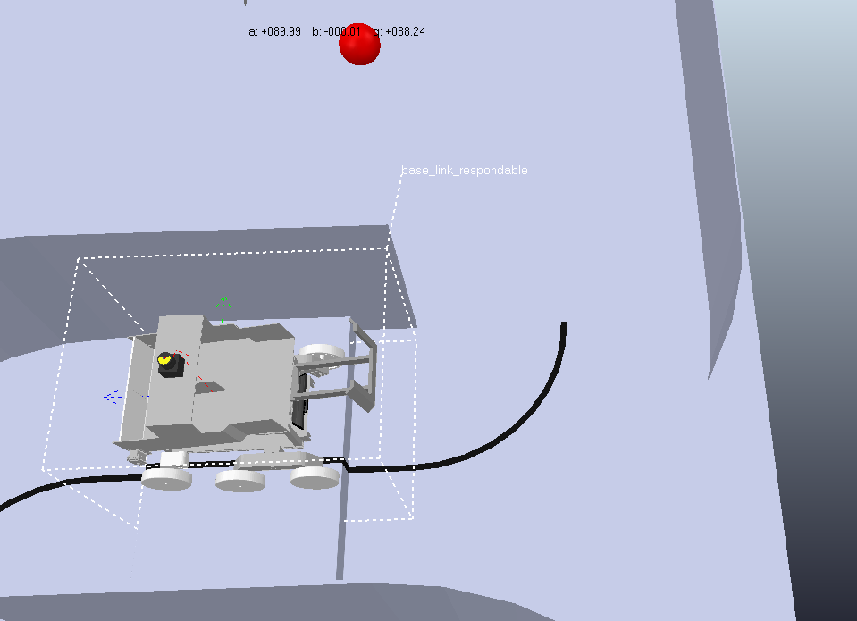

# README.md

## Starting command

For main mission, type a command below on the terminal. our model is **coppeliasim_models/teamE_robot_ver6_final.ttm**. Use environment setting as **Vortex, very accurate, dt = 50ms**. 

```bash
roslaunch data_integrate capstone_launch.launch
```

For bonus mission, type below command. Both mission share same environment settings.

```bash
roslaunch data_integrate bonus_launch.launch
```

## Instructions regarding manual transition

Our system publishes "/zone" topic to activate nodes for ball harvesting zone. However, you cannot change the robot control method by just publishing "/zone" topic manually.

Instead, just follow the steps below for using ball harvesting zone control.

1. Move robot on the step obstacle in the entrance zone like below picture. 
    <p align="center"><br><br></p>

2. set **DEBUG_HARVEST** as **true**. It is defined in **data_integrate/data_integration.cpp,** line 83 (approximately).
3. Type same command as before: 

```bash
roslaunch data_integrate capstone_launch.launch
```

## Required library list

In main mission, this package uses basic libraries such as std::msgs, opencv, etc. However, in bonus mission, we use icp algorithm in pcl library, so it requires pcl_conversions, pcl_ros library.

Perhaps all the packages are included in the ros full package, so if the simulation environment has a full ros noetic package, no additional dependency is required.
